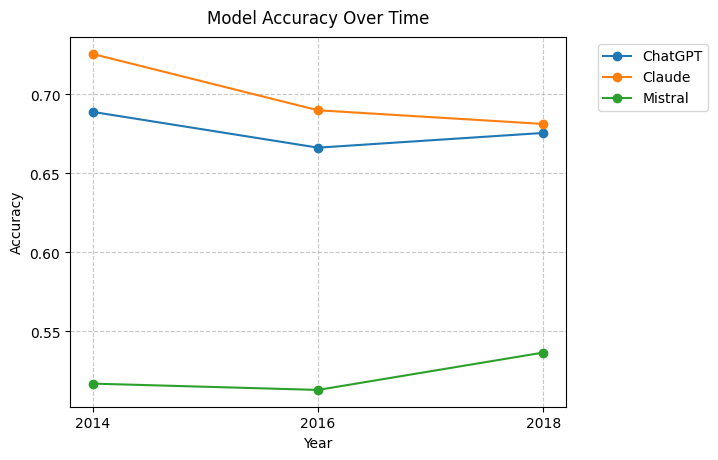
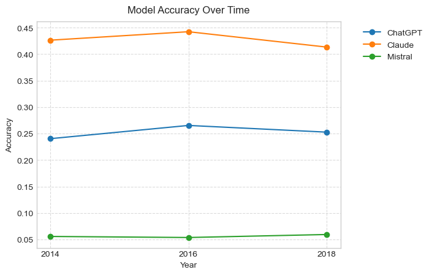
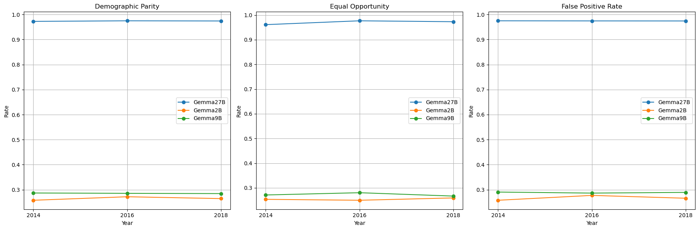

# fairshift

**Investigating distribution shift impact on LLM fairness.**

This repository contains the code, sampled data, model outputs, and figures for a Topics in NLP research project at the University of South Florida. The project studies how temporal and geographic distribution shifts affect fairness and performance in LLM income predictions across demographic groups.

Using the Folktables ACS dataset, the experiments evaluate three settings: baseline prompts without in-context examples, coverage-selected in-context learning (ICL), and scaling experiments with Gemma 2B/9B/27B. Fairness is tracked with demographic parity, equal opportunity, false positive rates, accuracy, and unknown-response rates.

## Key Findings

- Temporal and geographic distribution shifts produce measurable fairness degradation across gender, race, and state slices.
- Coverage-based ICL improves several fairness metrics under shift, especially demographic parity and equal opportunity.
- Scaling helps stabilize fairness more consistently than it improves raw accuracy.
- Smaller/local models are more likely to emit ambiguous responses that must be classified as `Unknown`.
- Fairness and accuracy move differently, so both should be reported when LLMs are used for structured prediction tasks.

## Figures







## Repository Structure

```text
.
├── data/
│   ├── original_1000_samples.csv
│   ├── sampled_datasets/
│   └── results/
│       ├── pre_icl/
│       ├── post_icl/
│       └── scaling/
├── figures/
│   ├── pre_icl/
│   ├── post_icl/
│   └── scaling/
├── notebooks/
├── scripts/
└── src/fairshift/
```

## Setup

```bash
python -m venv .venv
source .venv/bin/activate
pip install -r requirements.txt
cp .env.example .env
```

Fill `.env` with the provider keys you intend to use:

```bash
OPENAI_API_KEY=...
ANTHROPIC_API_KEY=...
MISTRAL_API_KEY=...
```

The Gemma and local Mistral experiments expect an OpenAI-compatible local server at `http://localhost:1234/v1` (for example, LM Studio).

## Reproducing Experiments

Pre-ICL baseline:

```bash
PYTHONPATH=src python scripts/run_pre_icl.py
```

Coverage-selected ICL:

```bash
PYTHONPATH=src python scripts/run_post_icl.py
```

Gemma scaling:

```bash
PYTHONPATH=src python scripts/run_scaling.py --model-name Gemma27B
```

The scripts write outputs under `data/results/`. Running the full experiment suite can take a long time and may incur API costs.

## Methods Summary

- **Dataset:** Folktables ACS income prediction task.
- **Years:** 2014, 2016, 2018.
- **States:** California, Texas, Michigan.
- **Models:** GPT-4o mini, Claude 3 Haiku, Mistral 7B, Gemma 2B/9B/27B.
- **Prompt target:** Predict whether annual income is above or below $50,000.
- **Fairness metrics:** Demographic parity, equal opportunity, false positive rate, accuracy by subgroup, and unknown-response rate.

## Citation

```bibtex
@misc{balaji2024fairshift,
  title = {Investigating Distribution Shift Impact on LLM Fairness},
  author = {Balaji, Sudharshan},
  year = {2024},
  institution = {University of South Florida}
}
```

## Security Note

This repository does not contain API keys. If you previously stored keys in scripts or notebooks, rotate them in the corresponding provider dashboards before publishing or reusing this project.
